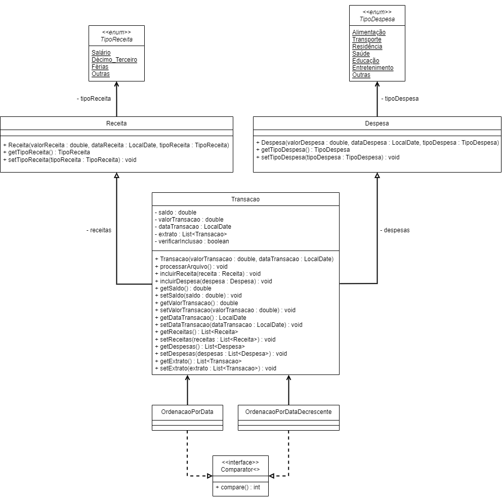
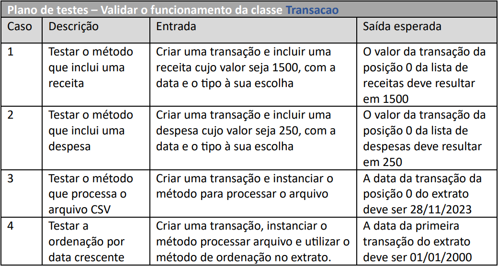

# ProjetoFinalPOO : Controle financeiro
Esse é o código do projeto final da matéria Programação Orientada à Objetos o qual realizei no 2º semestre da minha graduação.  
Realizado em trio juntamente com os meus colegas Filipe Augusto Peixer e Gustavo Arthur Haerthel.

O objetivo deste projeto era fazer um sistema que o usuário pudesse controlar suas finanças, adicionando suas receitas e despesas e podendo analisar esses gastos posteriormente devido ao "banco de dados" que utilizamos um arquivo CSV para guardar as informações.

Back-End: Java;  
Front-End: Java Swing;  
IDE: Apache NetBeans 17.

Para conseguir rodar o programa basta copiar o seu arquivo "PF_Dados.csv" para o disco local do seu computador ou então pegar o caminhoem que ele está localizado e alterar no código (precisa alterar dos métodos processarArquivo, incluirReceita e incluirDespesa para funcionar).

A seguir se encontram o diagrama de classes e o plano de testes do projeto:

  
